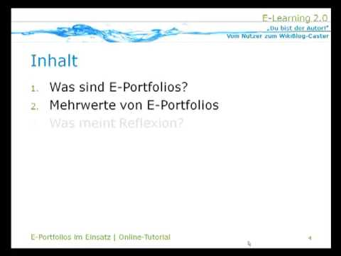
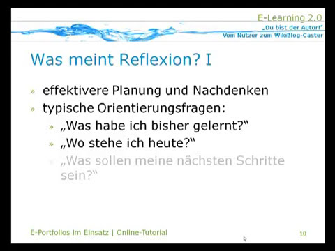

# Grundlagen
Zu Beginn:
Wenn Du überlegst, ob Du diesen Circle durchführen möchtest, dann schau Dir am besten einmal die nachfolgenden Grundlagen an, die wir für Dich zusammengestellt haben:

	• Was steckt eigentlich hinter der Idee eines ePortfolios und welche Mehrwerte kann es bieten?
	• Welche Bestandteile hat ein ePortfolio?
	• Wie funktioniert das Führen eines ePortfolios?
	• Was meint Reflektieren beim ePortfolio?

Anhand der ePortfolio Learning-Methode möchten wir, dass Ihr im Circle gemeinsam an einem von Dir oder Euch selbst gewählten, spannenden Thema arbeitet. Du kannst Dir dazu eine online sichtbare Expertise aufbauen. Außerdem besteht dadurch die Möglichkeit, Dich mit anderen zu diesem Thema zu vernetzen und eine neue Praxis-Community aufzubauen oder Dich einer anzuschließen. Nun schauen wir uns aber erstmal die Basics genauer an.

**1. Was steckt eigentlich hinter der Idee eines ePortfolios und welche Mehrwerte kann es bieten?**

Die Portfolio-Methode stammt ursprünglich aus dem künstlerischen Bereich, bei der mit Geschick gemachte Arbeiten (= Artefakte) in einer Sammelmappe zusammengestellt werden (portare = tragen und folio = Blatt im Lateinischen). Außerdem bespricht man die Inhalte dieser Mappe mit anderen, um sich im Prozess weiterzuentwickeln und später sogar bewerben zu können. Dies wurde durch den Einzug von digitalen Medien und des Internets auf die elektronische Nutzung übertragen. Dadurch ergeben sich auch mehr Möglichkeiten, ein ePortfolio zu gestalten.
Als weiterführenden Einstieg möchten wir Euch gerne ein kleines Online-Tutorial empfehlen, welches Marcel 2009 zu diesem Thema aufbereitet hat: [E-Portfolios im Einsatz](https://www.youtube.com/watch?v=6lwSyXD20Jg) (Länge ca. 9 min.)

For those who prefer it in written words we can describe ePortfolios
briefly and concisely as a hybrid form of online learning using
various social software. On the one hand this software serves to
transparently present oneself as a person with ones competencies and
to network with others (= social networking). On the other hand it is
used in combination with an appealing way of documenting the learning
process and results using digital media (= social publishing). What
has been learned is reflected in the process and specifically put up
for discussion (see Bernhardt / Kirchner 2007: 82 f. & Kirchner 2015:
32 f.).

 (CC BY)](./images/image4.jpeg)

Little scientific exkursion (optional):

For those who would like to know it in more detail the following
classification is recommended (quoted from Kirchner 2015: 32ff. and
translated corresponding into English):

The original classification in the German-speaking countries comes
from the Salzburg Research Society EduMedia:

"E-portfolio is a digital collection of works made with skill (=
lat. artefacts) of a person who wants to document and illustrate the
product (learning outcomes) and the process (learning pathway/growth)
of his or her competence development in a certain period of time and
for certain purposes. The person concerned has made the selection of
artefacts independently and organised them in relation to the learning
objective. He/she, as the owner, has complete control over who, when
and how much information from the portfolio can be viewed.
(Hornung-Prähauser et al. 2007: 14 and Hilzensauer/Hornung-Prähauser
2006:4)

*(see also [similar classification of terms](https://www.e-teaching.org/lehrszenarien/pruefung/pruefungsform/eportfolio) on e-teaching.org - German language only)*

According to this classification the product and process were always
in the foreground at first but the feedback loop was neglected and the
competencies required for this were only indicated. In addition,
metaphorically speaking, one also speaks of a showcase of ones own
learning (Bräuer 2000: 22, quoted after Brunner et al. 2008: 35 as
well as Bauer/Baumgartner 2012). This is at least the technological,
rather tool-oriented perspective.

From a pedagogical-didactic perspective, however, it is
classified more as a (didactic) method of independent and
competence-based learning and ist application of which is supported by
various processes (including selection, reflection and presentation)
with its own objectives and planning and can even go as far as a
holistic institutionally controlled pedagogical concept. In the past
this has led to an increasing confusion of terms.

Therefore the attempt was made to define an integrating view as a
method and to link it to social software:

According to this a social software portfolio is a specific form
of web-based self-presentation via an e-portfolio. The digital
processing of the artefacts offers the owner additional media options
for presenting learning products (especially in the form of audio and
video). By means of social software and especially the use of weblogs
such a portfolio also enables the owner to continuously reflect his
personal development of (media) skills and thus encourages reflection
in the self-directed connective learning process. This is particularly
supported by offering visitors the opportunity to provide feedback on
the content to the owner which in the case of e-portfolio blogs is
expressed primarily through the comment function or mutual
linking (quote from Kirchner 2015: 36)

**2. What are the components of an ePortfolio?**

Here there is a wealth of possibilities and tools that can be used in
different ways. The following is a recommendation based on our
previous experience.

Everyone of us already uses different online tools to create content
on the web even if its only to write an e-mail in a small circle or
to design a public website. This can be seen as a portal or gateway to
the Internet. With the help of this personal learning portal the
portfolio method can be applied directly, e.g. by having your own blog
and using a social network such as LinkedIn or Twitter to provide and
distribute your content (= artefacts).

In a broader sense content is generated through processes of setting
goals, collecting, selecting, linking and reflecting and finally
prepared for presentation, dissemination and possible evaluation (see
Kirchner 2015: 57 with reference to Hilzensauer, Hornung-Prähauser
2006: 5 or Hornung-Prähauser et al. 2007: 15). In the narrower sense
relevant content is taken up as a kind of an eye into the web and
published in a suitable manner via a showcase, e.g. as blog
entries and tweets (see Kirchner 2015: 57 with reference to Bräuer
2000: 22 and Baumgartner / Bauer 2013).

The following infographic visually summarizes these processes:

 (CC BY)](./images/image5.jpeg)

*According to a slightly adapted model of self-directed connective learning with e-portfolio blogs (Kirchner 2015: 58, Figure 11) as a further development following Bernhardt / Kirchner 2007: 89 and with reference to Hilzensauer, Hornung-Prähauser 2006: 5*

**3. How does the management of an ePortfolio work?**

When using an ePortfolio and applying the associated method the
following processes are essentially carried out which
have already been briefly mentioned above (see Hornung-Prähauser et
al. 2007: 15):

-   **Setting goals** to clarify the procedure and framework conditions for managing the ePortfolio.
-   **Collecting, selecting and linking** the contents in order to document the competence development in the learning process.
-   **Reflecting** in the ePortfolio in order to critically question ones own performance and analyze the learning goal.
-   **Presenting and passing** on the results to third parties in order to make the competence development visible.
-   **Assessing and evaluating** the ePortfolio in order to be able to assess the competence development holistically (optional).

**4. What does it mean to reflect with an ePortfolio?**

Therefor we recommend [the first two minutes]{.underline} of Marcels
second online tutorial:

[ePortfolios in use - part 2](https://www.youtube.com/watch?v=_h4Q4_YEFKU) (total length approx. 8 min.)

As the native language is German please activate subtitles and
choose English via the gear setting next to it:

Typical questions for orientation which you should ask yourself again
and again for reflection and which should be recorded as answers in
the ePortfolio are:

-   What have I learned so far?
-   Where do I stand today?
-   What should be my next steps?

(Atwell 2007, Hornung-Prähauser et al. 2007)

Now you have received all the important basic information about
learning with ePortfolios and you can continue on your learning path.

**Sources**

-   Attwell, Graham (2007): E-Portfolio Entwicklung und Verwendung. Ins Deutsche übersetzt von der Salzburg Research
    Forschungsgesellschaft.
    [http://blip.tv/pontydysgu/e-portfolio-entwicklung-und-verwendung-416096](http://blip.tv/pontydysgu/e-portfolio-entwicklung-und-verwendung-416096)
    [last possible access on 19.10.2013].
    Available alternative content on slideshare:
    [https://de.slideshare.net/GrahamAttwell/eportfolio-development-and-implementation](https://de.slideshare.net/GrahamAttwell/eportfolio-development-and-implementation)
    [access on 12.10.2020]

-   Bauer, R. / Baumgartner, P. (2012): Schaufenster des Lernens: Eine
    Sammlung von Mustern zur Arbeit mit E-Portfolios. Münster: Waxmann
    Verlag.

-   Baumgartner, P. / Bauer, R. (2012): Didaktische Szenarien mit
    E-Portfolios gestalten: Mustersammlung statt Leitfaden. In:
    Csanyi, G. / Reichl, F. / Steiner, A. (Hrsg.): Digitale Medien -
    Werkzeuge für exzellente Forschung und Lehre. Medien in der
    Wissenschaft, Band 61, S. 383-392. Münster: Waxmann.

-   Baumgartner, P. / Zauchner, S. / Bauer, R. (Hrsg.) (2009): The
    Potential of E-Portfolios in Higher Education.
    Innsbruck/Wien/Bozen: StudienVerlag.

-   Bernhardt, Thomas / Kirchner, Marcel (2007): E-Learning 2.0 im
    Einsatz - Du bist der Autor! - Vom Nutzer zum WikiBlog-Caster.
    vwh-Verlag, Boizenburg.

-   Bräuer, Gerd (2000): Schreiben als reflexive Praxis: Tagebuch,
    Arbeitsjournal, Portfolio. Freiburg im Breisgau: Fillibach-Verlag.

-   Brunner, I. / Häcker, T. / Winter, F. (Hrsg.) (2008): Das Handbuch
    Portfolioarbeit (2. Auflage). 1. Auflage 2006. Seelze-Velber:
    Kallmeyer.

-   Hilzensauer, W. / Hornung-Prähauser, V. (2006): ePortfolio --
    Methode und Werkzeug für kompetenzorientiertes Lernen. Salzburg
    Research Forschungsgesellschaft m.b.H. -- EduMedia [PDF]. Online
    verfügbar unter: [http://edumedia.salzburgresearch.at/images/stories/EduMedia/Inhalte/eportfolio_srfg.pdf](http://edumedia.salzburgresearch.at/)[last possible access on 03.12.2012]. Alternative link on:
    [https://docplayer.org/16445308-Eportfolio-methode-und-werkzeug-fuer-kompetenzbasiertes-lernen.html](https://docplayer.org/16445308-Eportfolio-methode-und-werkzeug-fuer-kompetenzbasiertes-lernen.html) access on 12.10.2020

-   Hornung-Prähauser, V., Geser, G., Hilzensauer, W., Schaffert, S.
    (2007): Didaktische, organisatorische und technologische
    Grundlagen von E-Portfolios und Analyse internationaler Beispiele
    und Erfahrungen mit E-Portfolio-Implementierungen an Hochschulen.
    Salzburg: Salzburg Research Forschungsgesellschaft und
    fnm-austria. Online verfügbar als PDF unter:
    [http://www.fnm-austria.at/projekte/ePortfolio/Dateiablage/view/fnm-austria_ePortfolio_Studie_SRFG.pdf](http://www.fnm-austria.at/projekte/ePortfolio/Dateiablage/view/fnm-austria_ePortfolio_Studie_SRFG.pdf)
    last possible access on 15.02.2013. Alternative link on:
    [https://www.yumpu.com/de/document/view/32927444/didaktische-organisatorische-und-technologische-grundlagen-von-](https://www.yumpu.com/de/document/view/32927444/didaktische-organisatorische-und-technologische-grundlagen-von-)
    [access on 12.10.2020]

-   Kirchner, Marcel (2015): Social-Software-Portfolios im Einsatz --
    Zwischen Online-Lernen und Medienkompetenz im
    selbstgesteuert-konnektiven Lernalltag. vwh-Verlag, Boizenburg.
