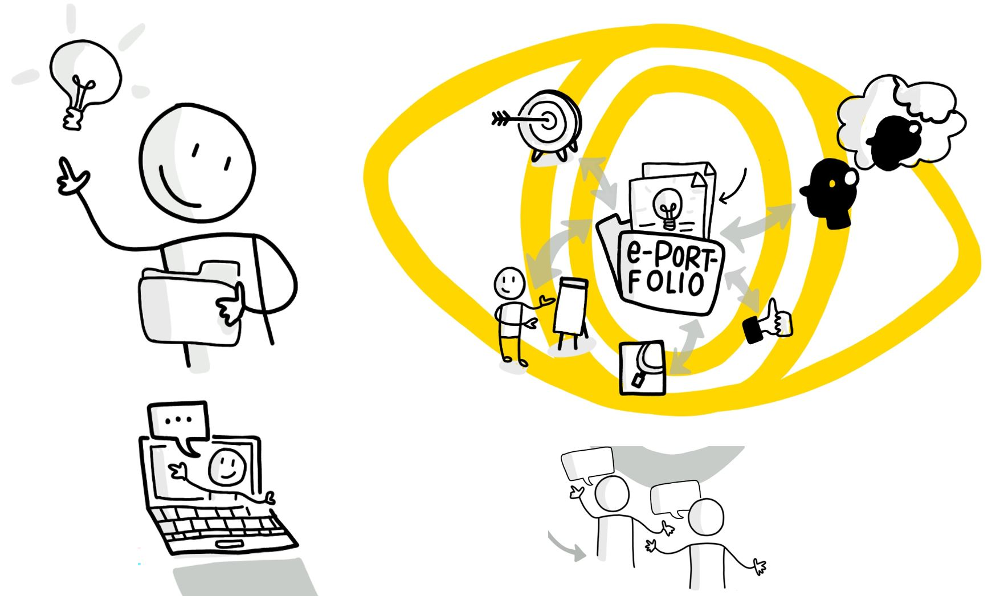

# Einführung
Als wir im September 2019 zu sechst unseren ersten lernOS Circle starteten, war noch nicht klar, wohin uns diese Lernreise letztlich führen wird. Aber uns war bewusst, dass wir dieses Experiment mit etwas verbinden wollten, was anderen, die es nach uns ausprobieren würden, auch etwas zurückgeben kann.

Grundsätzlich hatte jeder von uns sein eigenes Thema, dass er während der Zeit verfolgte. Trotzdem ermöglichte uns die gemeinsame Erfahrung, sich gegenseitig zu unterstützen und online miteinander auszutauschen, bei allen unseren Themen ein gutes Stück voranzukommen.

Daher kam relativ schnell der Entschluss, auch nach dem Circle zu dritt weiterzumachen und zwei eigene Leitfäden (Circle Guides) zu erstellen, die es anderen ermöglichen sollten, über verschiedene innovative Lernmethoden selbst diese Erfahrungen zu sammeln. So entstand letztlich hierdurch einer dieser beiden Leitfäden und wir hoffen, dass er Euch gut bei Eurer Lernreise begleiten kann.

**Zentrale Zielstellungen dieses ePortfolio Learning-Leitfadens**

Dieser Circle Guide möchte Euch eine Lernmethode zeigen, mit der Ihr Euch in einem spannenden Zukunftsthema weiterbilden und Euch mit anderen Lernern*innen darüber austauschen und vernetzen könnt.

Ihr werdet in der Lage sein, ein Basis- und Überblickswissen über die ePortfolio-Methode und Social Software zu erlernen.

Gleichzeitig werdet Ihr ein eigenes ePortfolio mit einer geeigneten Software aufbauen oder weiterentwickeln und mit anderen ein Detailwissen zu einem spannenden Thema erarbeiten.

Wir sind schon gespannt auf Eure Erfahrungsberichte und wünschen Euch nun viel Freude!

# Über lernOS

lernOS ist eine Methode zur Selbstorganisation für Menschen, die im 21. Jahrhundert leben und arbeiten. Um heute erfolgreich zu sein, muss man ständig lernen, sich organisieren und weiterentwickeln. Niemand sonst ist für diesen Prozess verantwortlich. Man muss sich selber darum kümmern (selbstgesteuertes, lebenslanges Lernen).

lernOS Leitfäden stehen unter der Lizenz [Creative Commons Attribution 4.0 International](https://creativecommons.org/licenses/by/4.0/deed.de) (CC BY 4.0):

Du darfst:

   * **Teilen** - das Material in jedwedem Format oder Medium vervielfältigen und weiterverbreiten.
   * **Bearbeiten** - das Material remixen, verändern und darauf aufbauen und zwar für beliebige Zwecke, sogar kommerziell.

**Unter folgenden Bedingungen:**

   - **Namensnennung** - Du musst angemessene Urheber- und Rechteangaben machen, einen Link zur Lizenz beifügen und angeben, ob Änderungen vorgenommen wurden. Diese Angaben dürfen in jeder angemessenen Art und Weise gemacht werden, allerdings nicht so, dass der Eindruck entsteht, der Lizenzgeber unterstütze gerade Sie oder Ihre Nutzung besonders.
   - **Keine weiteren Einschränkungen** - Du darst keine zusätzlichen Klauseln oder technische Verfahren einsetzen, die anderen rechtlich irgendetwas untersagen, was die Lizenz erlaubt.
